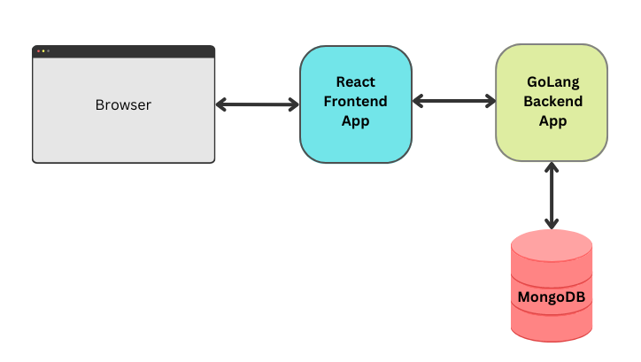

# React Go App
A simple application build using JavaScript/React frontend and GoLang backend. 


# Start
```
% docker-compose up -d --force-recreate
[+] Running 4/4
 ⠿ Network react-go-app_default     Created
 ⠿ Container react-go-app-client-1  Started
 ⠿ Container react-go-app-server-1  Started
 ⠿ Container react-go-app-db-1      Started
```

# Initialize the sample database
```
% docker exec -it `docker ps -q -f name=db` mongo /scripts/InitDB.js
MongoDB shell version v4.2.6
connecting to: mongodb://127.0.0.1:27017/?compressors=disabled&gssapiServiceName=mongodb
Implicit session: session ...
MongoDB server version: 4.2.6
Inserting: 1 Imagination is more important than knowledge. Knowledge is limited. Imagination encircles the world
Inserting: 2 Try not to become a man of success, but rather try to become a man of value
Inserting: 3 Life is like riding a bicycle. To keep your balance you must keep moving
Inserting: 4 Look deep into nature, and then you will understand everything better
Inserting: 5 Logic will get you from A to B. Imagination will take you everywhere
Inserting: 6 Insanity is doing the same thing over and over again and expecting different results
Inserting: 7 The hardest thing to understand in the world is the income tax
```
# Test local server
```
% curl -i http://localhost:8080/quote
HTTP/1.1 200 OK
Access-Control-Allow-Origin: *
Content-Type: application/json
Date: Thu, 29 Dec 2022 23:10:46 GMT
Content-Length: 129

{"ObjectId":"63acf4244efcbcd7fecfbf8b","id":3,"quote":"Life is like riding a bicycle. To keep your balance you must keep moving"}
```
